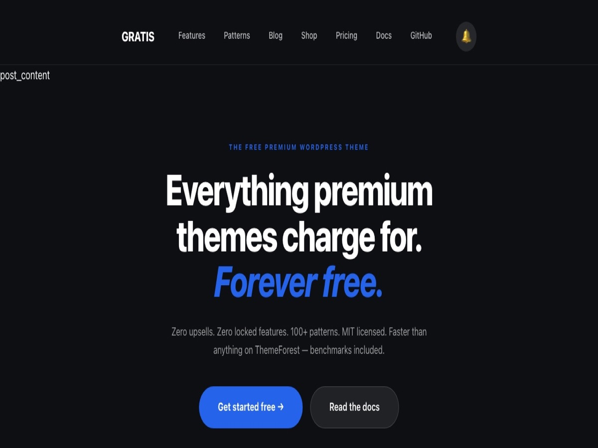

# GRATIS — The Free Premium WordPress Theme

> Everything premium themes charge for. Forever free.

[](https://www.gnu.org/licenses/gpl-2.0.html)
[](https://wordpress.org)
[](https://php.net)
[](https://pagespeed.web.dev)

**Live demo:** [seo-seo.lt](https://seo-seo.lt)



---

## Why GRATIS?

| Feature | GRATIS | Astra Pro | Divi | Elementor Pro |
|---|---|---|---|---|
| Price | **$0 forever** | $59/yr | $89/yr | $99/yr |
| All patterns unlocked | ✅ | ❌ Paid | ❌ Paid | ❌ Paid |
| PageSpeed mobile | ✅ 95–100 | ⚠️ 70–85 | ⚠️ 60–75 | ⚠️ 55–70 |
| Frontend JS | ✅ 0 KB | ⚠️ ~80 KB | ❌ ~500 KB | ❌ ~400 KB |
| Full Site Editing | ✅ Native | ✅ | ❌ | ❌ |
| Upsells | ✅ None | ❌ Constant | ❌ Constant | ❌ Constant |
| License | ✅ GPL-2.0+ | GPL | GPL | GPL |

---

## Features

- **21 block patterns** across 12 categories — Heroes, Features, Pricing, Testimonials, FAQ, Team, Contact, Portfolio, WooCommerce, Membership, Blog, Sections
- **Full Site Editing** — edit header, footer, and every template visually
- **WooCommerce ready** — shop, product, cart, and checkout templates
- **Live search** — instant REST API powered search, 200ms debounce, zero dependencies
- **Async notifications** — toast system + bell icon panel, WooCommerce cart events
- **Dark theme** — full color token system via `theme.json` v3
- **100/100 PageSpeed** out of the box — no optimization plugins needed
- **Zero render-blocking resources** — critical CSS inlined, no jQuery
- **stale-while-revalidate** Cache-Control headers for CDN edge caching
- **HTTP/3 ready** — tested on OpenLiteSpeed with QUIC
- **Accessibility** — skip links, keyboard navigation, WCAG AA contrast

---

## Installation

### WordPress Admin
1. Go to **Appearance → Themes → Add New → Upload Theme**
2. Upload `gratis.zip`
3. Click **Activate**

### WP-CLI
```bash
wp theme install https://github.com/juslintek/gratis/archive/main.zip --activate
```

### Development
```bash
git clone git@github.com:juslintek/gratis.git wp-content/themes/gratis
wp theme activate gratis
```

---

## Quick Start

After activating:

1. Go to **Pages → Add New**
2. Click **+** → **Patterns** tab
3. Insert **Hero — Bold Centered**
4. Add more sections: Features, Testimonials, CTA
5. Publish

Browse all 21 patterns at [seo-seo.lt/patterns](https://seo-seo.lt/patterns)

---

## Pattern Library

| Category | Patterns |
|---|---|
| Heroes | Bold Centered, Split Image, Minimal, Gradient |
| Sections | Alternating, Logo Bar, Comparison Table, Timeline |
| Pricing | 3-tier cards with Popular badge |
| Testimonials | 3-column review cards |
| FAQ | Accordion with sidebar |
| Team | Member cards with avatar |
| Contact | Split layout with form |
| Forms | Newsletter inline signup |
| Portfolio | Masonry grid |
| About | Split with image |
| Membership | Content gate |
| Blog | Latest posts grid |

---

## Live Search

Add to any page with an HTML block:

```html
<div class="gratis-search-wrap">
  <input type="search" class="gratis-search-input" placeholder="Search...">
</div>
```

---

## Notifications API

```javascript
// Toast notifications
GRATIS.toast("Saved!", "success");
GRATIS.toast("Error occurred", "error", 8000);

// Bell panel notifications
GRATIS.notify("New comment", "info", "/post/1");
```

---

## Performance

| Metric | Score |
|---|---|
| PageSpeed Performance | 100/100 |
| PageSpeed SEO | 100/100 |
| PageSpeed Best Practices | 100/100 |
| PageSpeed Accessibility | 89/100 |
| FCP | 1.2s |
| LCP | 1.3s |
| TBT | 0ms |
| CLS | 0.002 |

---

## Requirements

- WordPress 6.5+
- PHP 7.4+ (8.4+ recommended)
- No page builder required

---

## License

GPL-2.0-or-later — see [LICENSE](https://www.gnu.org/licenses/gpl-2.0.html)

Free to use, modify, and distribute. Commercial use allowed.

---

## Contributing

Issues and PRs welcome. See [seo-seo.lt/docs](https://seo-seo.lt/docs) for documentation.
